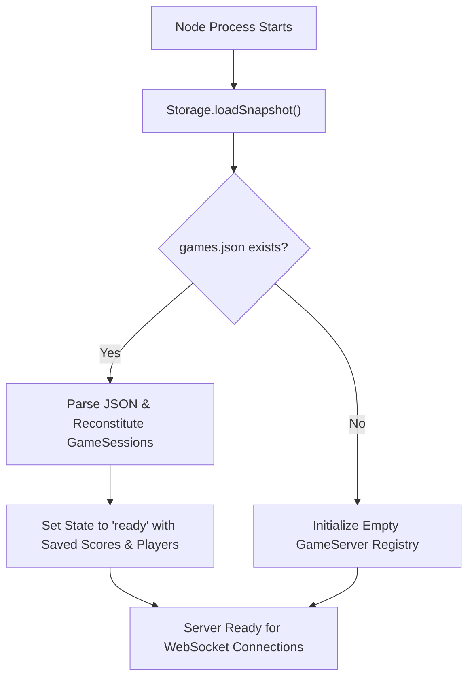

# Match State Persistence & Self-Updating Deployment Plan

> **Date:** 2026-08-20  
> **Topic:** Match State Persistence, Cold-Boot Recovery, and Self-Updating Service Deployment  
> **Status:** Completed

---

## 1. Overview & Goals

1. **Match State Persistence:**
   - Persist active game sessions, player registrations, accumulated scores, and match statistics to a lightweight, crash-safe atomic JSON file.
   - On process reboot / deployment restart, automatically restore all existing game rooms in a clean `'ready'` state with accumulated scores intact.
2. **Self-Updating & Portable Deployment (`scripts/deploy.sh` & `tron.service`):**
   - Introduce `.env.example` and local `.env` support for zero-argument or parameterized deployments.
   - Parameterize `tron.service` with standard placeholders (`__PATH__`, `__USER__`, `__HOME__`, `__PORT__`).
   - Add automatic remote substitution and `cmp -s` diffing in `scripts/deploy.sh` to update `/etc/systemd/system/tron.service` seamlessly upon deployment.
   - Ensure `/srv/tron/data/` is preserved across builds.

---

## 2. Architecture & Data Flow

### A. Directory Structure

```
/srv/tron/
├── data/
│   └── games.json           # <-- Persistent atomic snapshot (survives deployments)
├── deploy/                  # <-- Incoming rsync payload
├── build/                   # <-- Staging build directory
└── run/                     # <-- Live active daemon directory
```

### B. Atomic Snapshot Pattern (`server/Storage.js`)

- **Storage Location:** Configured via `process.env.DATA_DIR` (defaults to `./data/games.json` in local development, or `/srv/tron/data/games.json` in production).
- **Write Mechanism:**
  1. Serialize in-memory match registry into JSON string.
  2. Write to temporary file: `games.json.tmp`.
  3. Atomically rename `games.json.tmp` $\rightarrow$ `games.json` via POSIX kernel `renameSync()`.
- **Trigger Points:** Only writes on discrete state transitions:
  - Game created (`CREATE_GAME`)
  - Player added (`ADD_PLAYER`)
  - Round finished (`GAME_FINISH` / score update)
  - Game destroyed / timed out
  - _Zero disk I/O during the 40 FPS real-time physics loop._

### C. Cold-Boot Recovery Flow



---

## 3. Implementation Phases

### Phase 1: Environment & Deployment Modernization

- **Files:**
  - Create `.env.example` with documented environment variables (`DEPLOY_TARGET`, `DEPLOY_PATH`, `DEPLOY_PORT`).
  - Add `.env` to `.gitignore`.
  - Update `tron.service` with placeholders (`__PORT__`, `__PATH__`, `__USER__`, `__HOME__`).
  - Update `scripts/deploy.sh`:
    - Load `.env` with fallback error handling.
    - Ensure remote `/srv/tron/data/` directory exists.
    - Substitute placeholders into `build/tron.service`.
    - Compare with `/etc/systemd/system/tron.service` via `cmp -s` and run `systemctl daemon-reload` when modified.

### Phase 2: Atomic Storage Engine (`server/Storage.js`)

- **Files:**
  - Create `server/Storage.js`:
    - Method `saveGames(games)`: Atomic write to `games.json`.
    - Method `loadGames()`: Safe read and parse of `games.json`.
    - Serialization helper extracting only recoverable fields (`key`, `name`, `interval`, `isPublic`, `started`, `players`, `scores`, `updatedAt`).

### Phase 3: GameServer & GameSession Integration

- **Files:**
  - `server/GameServer.js`:
    - Load persisted snapshot on constructor initialization.
    - Call `Storage.saveGames(this.games)` on game creation, destruction, and change events.
  - `server/GameSession.js`:
    - Add `restore({ key, name, interval, isPublic, started, players, scores })` constructor / factory logic.
    - Trigger storage save on player registration and score calculation.

### Phase 4: Verification, Cleanup & Documentation

- **Tasks:**
  - Test cold restart: Create a game locally, add players, restart server, verify room and scores persist.
  - Update `README.md` and `ROADMAP.md`.
  - Validate with `npx eslint .`.

---

## 4. Verification Checklist

- [x] `.env.example` provides clear documentation for deployment variables.
- [x] `scripts/deploy.sh` correctly resolves environment variables and detects `tron.service` changes.
- [x] `server/Storage.js` writes crash-safe atomic JSON files.
- [x] `GameServer` cold-boot recovers rooms, registered players, and accumulated scores.
- [x] Active physics loop runs with zero disk writes.
- [x] Full lint checks pass with `npx eslint .`.
