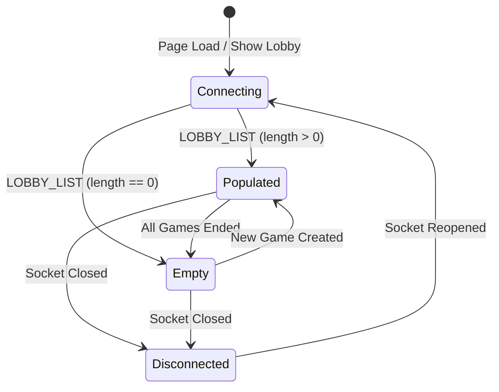

# Lobby Connection & Loading State Feedback Plan

> **Date:** 2026-08-21  
> **Topic:** Inline Lobby Table Connection, Loading, and Empty State Indicators  
> **Status:** Completed  

---

## 1. Overview & Goals

When a player visits or reloads the application, the lobby games table is currently empty while the WebSocket connection establishes and waits for the server's initial `MSG_TYPE.LOBBY_LIST` response. On slow networks, this blank table can be confusing (leaving the user unsure if the server is offline, connecting, or simply has 0 active rooms).

This plan introduces clear, retro-styled inline table feedback inside `#body-gamelisttable`:
1. **Connecting / Fetching:** Clear feedback while waiting for initial server handshake and room list.
2. **Empty State:** Friendly guidance when connected but no rooms currently exist.
3. **Reconnection Feedback:** Informative status if the socket disconnects while viewing the lobby.

---

## 2. UI & Design Architecture

To maintain Tron's clean retro design aesthetic without intrusive spinners or layout-shifting modals, feedback will be rendered directly inside the table body using a centered, 5-column spanning row (`<td colspan="5">`):

### A. State Transitions

### B. Display States

| State | Visual Text | Style |
| :--- | :--- | :--- |
| **Connecting / Loading** | `Connecting to server & fetching games...` | `.fg-fg-muted`, centered, padding |
| **Empty (0 Games)** | `No active games found. Create one above to get started!` | `.fg-fg-muted`, centered, padding |
| **Disconnected** | `Connection lost. Reconnecting to server...` | `.fg-rose-muted`, centered, padding |
| **Populated** | Normal game list table rows (`Id`, `Name`, `#Players`, `Status`, `Join`) | Standard table styling |

---

## 3. Implementation Details

### File: `public/javascripts/ui/lobbyView.js`

1. **Add `renderStatusRow(message, extraClass = 'fg-fg-muted')` Helper:**
   * Clears `this.bodyGamelistTable`.
   * Inserts a single `<tr>` with `<td colspan="5" class="${extraClass}">`.

2. **Handle Lifecycle Events:**
   * In `show()`: If `state.gamesList` is empty or not yet loaded, render `Connecting to server & fetching games...`.
   * In `updateGamelistTable(list)`:
     * If `list.length === 0`: Call `renderStatusRow('No active games found. Create one above to get started!')`.
     * If `list.length > 0`: Render active game rows as normal.
   * On `network.on('close')`: If lobby is active, render `Connection lost. Reconnecting to server...` in `fg-rose-muted`.
   * On `network.on('open')`: Reset to connecting message and request fresh lobby list.

---

## 4. Verification Checklist

- [x] Table immediately displays "Connecting to server..." on fresh page load while WebSocket handshake is in progress.
- [x] Displays "No active games found..." when server returns an empty game list (`[]`).
- [x] Transitions to populated game rows as soon as games exist.
- [x] Displays "Connection lost. Reconnecting..." if the server process is stopped while on the lobby screen.
- [x] Clean retro appearance with zero layout jumps or CSS styling issues.
- [x] `npx eslint .` passes with 0 errors.
