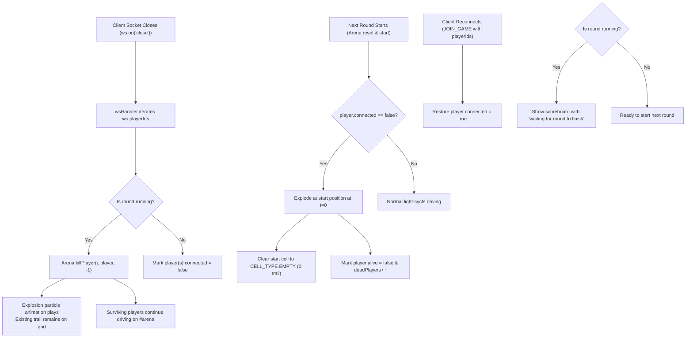

# Disconnected Client Lifecycle & Trail Ghosting Plan

> **Date:** 2026-08-22  
> **Topic:** Disconnected Client Lifecycle, In-Match Explosion, and Start-Round Ghost Trail Elimination  
> **Status:** Completed  

---

## 1. Overview & Goals

In multiplayer Tron matches, when a client closes their browser tab or loses network connectivity mid-game:
1. **Mid-Round Client Disconnect:** The client's WebSocket connection drops (`ws.on('close')`). The server immediately eliminates all players owned by that socket at their current coordinates with an explosion, while **leaving their existing trail intact on the arena grid** as a physical obstacle for surviving players.
2. **Undisturbed Live Gameplay:** Connected, driving clients continue their match on `#arena` without UI interruptions or blank screens.
3. **Subsequent Rounds (While Client Remains Offline):** At round start ($t=0$), any player whose client is still offline explodes immediately at their starting dot with **zero trail left on the grid** (`CELL_TYPE.EMPTY`), preventing ghost obstacles.
4. **Reconnection & Spectating:** When a disconnected client reopens the page / reconnects:
   - If a round is actively running: the client enters as a spectator showing the scoreboard with *"waiting for current round to finish"*.
   - On the next round: the client automatically joins active driving with controls restored.
5. **Scoreboard & UI:** Disconnected players are displayed with a `[disconnected]` badge and dimmed opacity on the scoreboard and player tables.

---

## 2. Architecture & Data Flow

---

## 3. Implementation Checklist

- [x] Add `connected: Boolean` to `shared/Player.js`.
- [x] Implement `disconnectPlayer()`, `reconnectPlayer()`, and `startRound()` in `server/Arena.js`.
- [x] Track `ws.playerIds` in `server/wsHandler.js` and wire up `ws.on('close')` and reconnect in `JOIN_GAME`.
- [x] Attach `connected` status to player stats in `server/GameSession.js`.
- [x] Fix `#scores-waiting` CSS overlay positioning in `public/stylesheets/components.css`.
- [x] Ensure non-disruptive `GAME_INFO` handling in `public/javascripts/main.js`.
- [x] Render `[disconnected]` and local vs remote player colors in `public/javascripts/ui/gameView.js` and `public/javascripts/ui/configView.js`.
- [x] Create automated lifecycle and persistence tests in `scratch/`.
- [x] Run `npm test` and `npx eslint .`.
